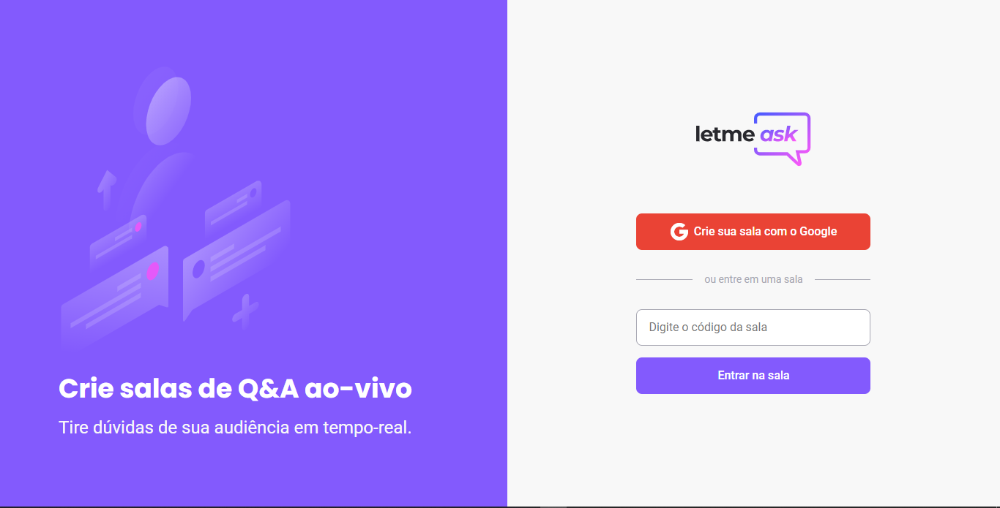
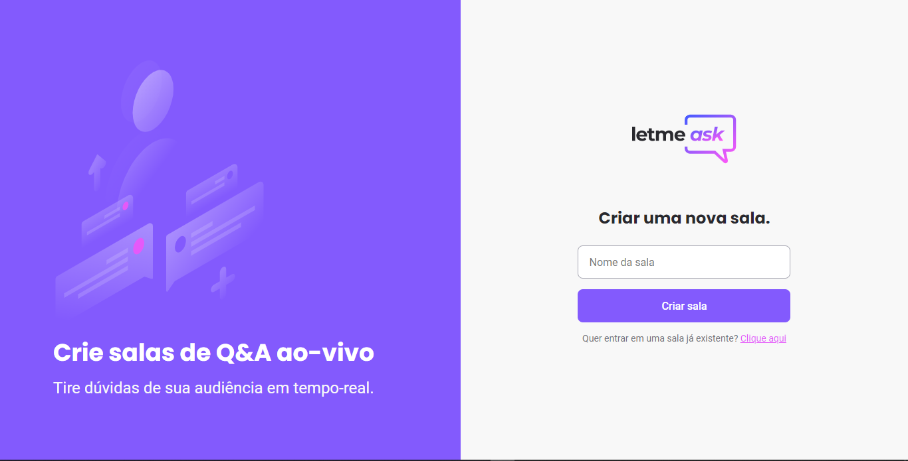
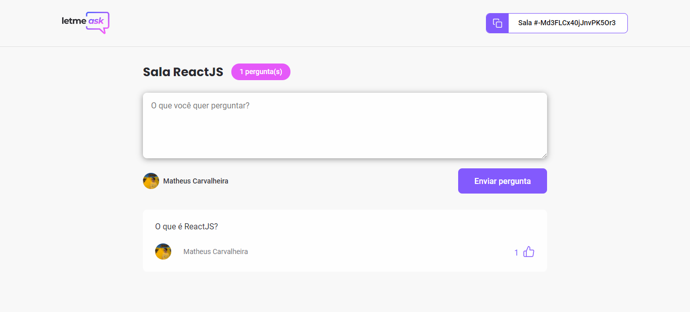
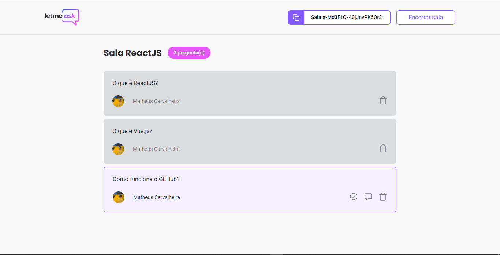

<p align="center">
  
</p>

### **Next Level Week** #06 #NLW @Rocketseat 📳

---

<h3 align="center">
  <a href="https://letmeask-bd05a.web.app/">Acessar demonstração!<a>
</h3>

---

# 💻 Interface Web!

<p>
  
  
  
  
</p>

---

## 🔎 Tecnologias usadas:

Esse projeto foi feito usando essas tecnologias:

- [Typescript](https://www.typescriptlang.org/)

- [ReactJS](https://reactjs.org/)

- [Firebase](https://firebase.google.com/)

- [SASS](https://sass-lang.com/)

---

## 🎥 Como rodar o projeto:

```bash
# Clone no repositório com o comando:
$ git clone https://github.com/matheuscarvalheira/Letmeask.git

#Entre no diretório:
$ cd letmeask
```

```bash
# Instalar dependências:
$ yarn install

# Rodar a aplicação:
$ yarn start
```

🚀 Agora é só ir em: http://localhost:3000/ para ver os resultados em tela.
